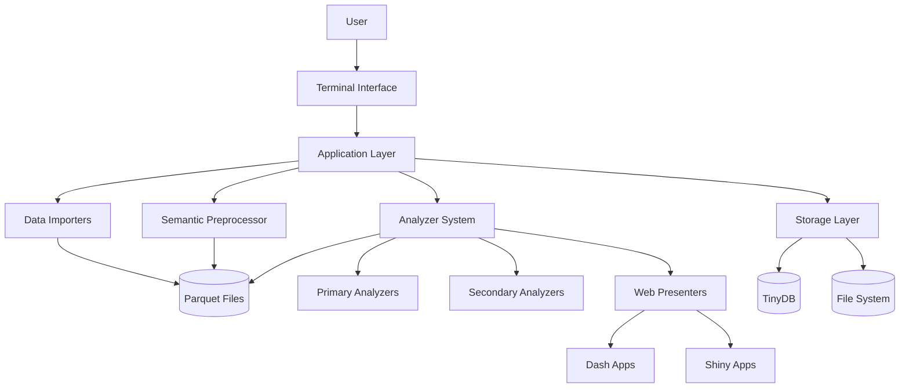
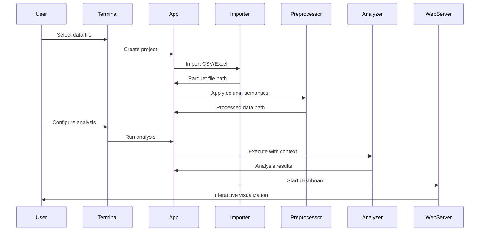

# Architecture Overview

## High-Level Component Diagram



## Core Abstractions

### Application Layer (`app/`)

Central orchestration and workspace management

Key Classes:

- `App` - Main application controller, orchestrates all operations
- `AppContext` - Dependency injection container for application-wide services
- `ProjectContext` - Project-specific operations and column mapping
- `AnalysisContext` - Analysis execution environment and progress tracking
- `AnalysisOutputContext` - Handles analysis result management
- `AnalysisWebServerContext` - Web server lifecycle management
- `SettingsContext` - Configuration and user preferences

### View Layer (`components/`)

Terminal UI components using inquirer

Key Components:

- `ViewContext` - UI state management and terminal context
- `main_menu()` - Application entry point menu
- `splash()` - Application branding and welcome
- Menu flows: project selection, analysis creation, parameter customization
- Server management: web server lifecycle, export workflows

### Model Layer (`storage/`)

Data persistence and state management

Key Classes:

- `Storage` - Main storage controller, manages projects and analyses
- `ProjectModel` - Project metadata and configuration
- `AnalysisModel` - Analysis metadata, parameters, and state
- `SettingsModel` - User preferences and application settings
- `FileSelectionState` - File picker state management
- `TableStats` - Data statistics and preview information

### Infrastructure Layer (`app/`)

Cross-cutting concerns and shared infrastructure

Key Components:

- `Logger` - Application-wide structured JSON logging system
  - **Dual handlers**: Console (ERROR+) and file (INFO+) output separation
  - **JSON formatting**: Structured logs with timestamps and context
  - **Auto rotation**: 10MB files with 5 backup retention
  - **CLI integration**: Configurable log levels via `--log-level` flag
  - **Location**: `~/.local/share/MangoTango/logs/mangotango.log`

- `MemoryManager` - Intelligent memory management and system detection
  - **Auto-detection**: System RAM analysis with tiered allocation strategies
  - **Adaptive limits**: 20-40% allocation based on system capacity (≥32GB: 40%, ≥16GB: 30%, ≥8GB: 25%, <8GB: 20%)
  - **Pressure monitoring**: Real-time memory usage tracking and adaptive scaling
  - **Fallback thresholds**: System-specific limits for disk-based processing

## Data Flow Architecture

### Import → Analysis → Export Pipeline



### Context-Based Dependency Injection

Each layer receives context objects containing exactly what it needs:

```python
# Analyzer Context Pattern
class AnalysisContext:
    input_path: Path           # Input parquet file
    output_path: Path          # Where to write results
    preprocessing: Callable    # Column mapping function
    progress_callback: Callable # Progress reporting
    parameters: dict           # User-configured parameters

class AnalysisWebServerContext:
    primary_output_path: Path
    secondary_output_paths: list[Path]
    dash_app: dash.Dash        # For dashboard creation
    server_config: dict
```

### Progress Reporting Architecture

The application uses a hierarchical progress reporting system built on the Rich library for terminal display:

```python
# Hierarchical Progress Manager
class RichProgressManager:
    # Main step management
    def add_step(step_id: str, title: str, total: int = None)
    def start_step(step_id: str)
    def update_step(step_id: str, progress: int)
    def complete_step(step_id: str)
    
    # Sub-step management for detailed progress tracking
    def add_substep(parent_step_id: str, substep_id: str, description: str, total: int = None)
    def start_substep(parent_step_id: str, substep_id: str)
    def update_substep(parent_step_id: str, substep_id: str, progress: int)
    def complete_substep(parent_step_id: str, substep_id: str)
```

**Enhanced N-gram Analysis Progress Flow**:

- Steps 1-8: Data processing with traditional progress reporting
- Steps 9-11: Final write operations with hierarchical sub-step progress
  - Each write operation broken into 4 sub-steps (prepare, transform, sort, write)
  - Eliminates silent processing periods during final 20-30% of analysis time
  - Memory-aware progress calculation based on dataset size

**Integration Points**:

- `AnalysisContext.progress_callback` provides progress manager to analyzers
- Enhanced write functions use sub-step progress for granular feedback
- Rich terminal display with hierarchical progress visualization
- Thread-safe progress updates with display locks

## Core Domain Patterns

### Analyzer Interface System

Declarative analysis definition

```python
# interface.py
interface = AnalyzerInterface(
    input=AnalyzerInput(
        columns=[
            AnalyzerInputColumn(
                name="author_id",
                semantic_type=ColumnSemantic.USER_ID,
                required=True
            )
        ]
    ),
    outputs=[
        AnalyzerOutput(
            name="hashtag_analysis",
            columns=[...],
            internal=False  # User-consumable
        )
    ],
    params=[
        AnalyzerParam(
            name="time_window",
            param_type=ParamType.TIME_BINNING,
            default="1D"
        )
    ]
)
```

### Three-Stage Analysis Pipeline

1. **Primary Analyzers** - Raw data processing
   - Input: Preprocessed parquet files
   - Output: Normalized analysis results
   - Examples: hashtag extraction, n-gram generation, temporal aggregation

2. **Secondary Analyzers** - Result transformation
   - Input: Primary analyzer outputs
   - Output: User-friendly reports and summaries
   - Examples: statistics calculation, trend analysis

3. **Web Presenters** - Interactive visualization
   - Input: Primary + secondary outputs
   - Output: Dash/Shiny web applications
   - Examples: interactive charts, data exploration interfaces

### Performance Optimization Architecture

The application includes sophisticated performance optimization strategies for handling large datasets efficiently across different system configurations.

#### Memory-Aware Processing

**Adaptive Memory Management**:

```python
# System-aware memory allocation
class MemoryManager:
    def __init__(self):
        total_gb = psutil.virtual_memory().total / 1024**3
        if total_gb >= 32:
            self.allocation_factor = 0.4    # High-memory systems
        elif total_gb >= 16:
            self.allocation_factor = 0.3    # Standard systems
        else:
            self.allocation_factor = 0.25   # Conservative systems
```

**Tiered Processing Strategy**:

- **In-Memory Processing**: Optimal for datasets within memory constraints
- **Chunked Processing**: Adaptive chunk sizes based on system capabilities
- **Disk-Based Fallback**: External sorting and streaming for constrained systems

#### Performance Components

**Memory Strategies** (`analyzers/ngrams/memory_strategies.py`):

- `ExternalSortUniqueExtractor` - Disk-based unique extraction for large datasets
- Temporary file management with cleanup
- Configurable chunk sizes based on system memory

**Fallback Processors** (`analyzers/ngrams/fallback_processors.py`):

- `generate_ngrams_disk_based()` - Minimal memory n-gram generation
- `stream_unique_memory_optimized()` - Streaming unique extraction
- Memory pressure detection and adaptive processing

#### Chunk Size Optimization

**System-Specific Scaling**:

- **≥32GB systems**: 2.0x chunk size multiplier (200K-400K rows)
- **≥16GB systems**: 1.5x chunk size multiplier (150K-300K rows)  
- **≥8GB systems**: 1.0x baseline chunks (100K-200K rows)
- **<8GB systems**: 0.5x conservative chunks (50K-100K rows)

**Fallback Thresholds**:

- **High-memory systems**: 3M+ rows before disk-based processing
- **Standard systems**: 1.5M+ rows before disk-based processing
- **Constrained systems**: 500K+ rows before disk-based processing

## Integration Points

### External Data Sources

- **CSV Importer**: Handles delimiter detection, encoding issues
- **Excel Importer**: Multi-sheet support, data type inference
- **File System**: Project directory structure, workspace management

### Web Framework Integration

- **Dash Integration**: Plotly-based interactive dashboards
- **Shiny Integration**: Modern Python web UI framework
- **Server Management**: Background process handling, port management

### Export Capabilities

- **XLSX Export**: Formatted Excel files with multiple sheets
- **CSV Export**: Standard comma-separated values
- **Parquet Export**: Native format for data interchange

## Key Architectural Decisions

### Parquet-Centric Data Flow

- All analysis data stored as Parquet files
- Enables efficient columnar operations with Polars
- Provides schema validation and compression
- Facilitates data sharing between analysis stages

### Context Pattern for Decoupling

- Eliminates direct dependencies between layers
- Enables testing with mock contexts
- Allows analyzer development without application knowledge
- Supports different execution environments (CLI, web, testing)

### Domain-Driven Module Organization

- Clear boundaries between core, edge, and content domains
- Enables independent development of analyzers
- Supports plugin-like extensibility
- Facilitates maintenance and testing

### Semantic Type System

- Guides users in column selection for analyses
- Enables automatic data validation and preprocessing
- Supports analyzer input requirements
- Provides consistent UX across different data sources
