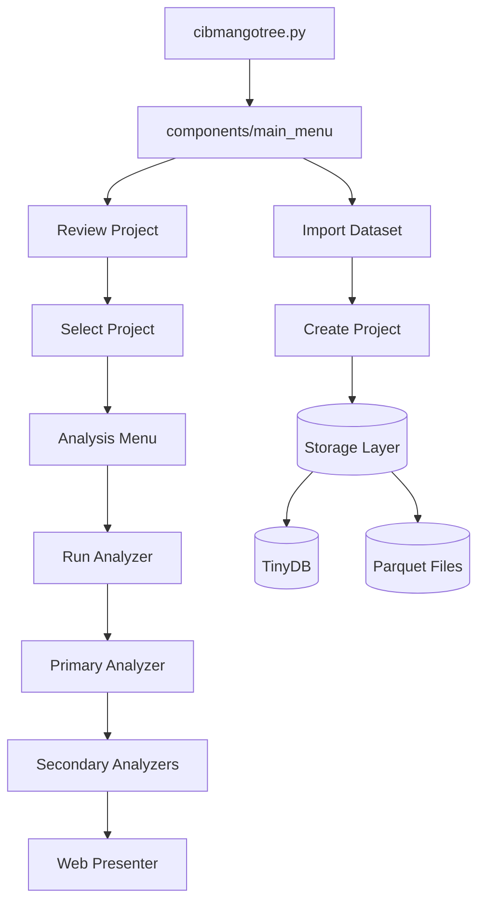
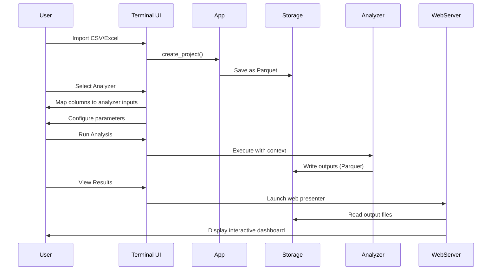

# Mango Tango CLI - Developer Onboarding Guide

**Analysis Date:** October 7, 2025

---

## TL;DR - Quick Start

**What is this?** A Python CLI tool for detecting coordinated inauthentic behavior in social media data using pluggable analyzers.

**Get running in 3 steps:**
```bash
python -m venv venv && ./bootstrap.sh  # Setup
python cibmangotree.py                 # Run
# Import sample data → Select analyzer → View results
```

**Want to create an analyzer?**
1. Copy `analyzers/example/` structure
2. Define interface in `interface.py` (inputs, outputs, params)
3. Implement analysis in `main.py` (Polars-based)
4. Register in `analyzers/__init__.py`

**Key concepts:**
- **Primary analyzers**: Process raw data → output files
- **Secondary analyzers**: Post-process primary outputs
- **Web presenters**: Visualize results in Dash/Shiny
- **Everything is Parquet**: CSV/Excel imports → Parquet → Analysis → Parquet → Web viz

**Critical gotcha:** Always call `input_reader.preprocess()` before using input data - it maps user columns to your schema.

---

## Table of Contents

- [Overview](#overview)
- [Getting Started](#getting-started)
  - [Prerequisites](#prerequisites)
  - [Initial Setup](#initial-setup)
  - [First Run Experience](#first-run-experience)
  - [Quick Validation](#quick-validation)
- [Architecture](#architecture)
  - [High-Level Design](#high-level-design)
  - [Directory Structure](#directory-structure)
  - [Core Abstractions](#core-abstractions)
  - [Data Flow](#data-flow)
  - [Extension Points](#extension-points)
- [How To](#how-to)
  - [Run Tests](#run-tests)
  - [Add a Web Presenter](#add-a-web-presenter)
  - [Add a Secondary Analyzer](#add-a-secondary-analyzer)
  - [Debug an Analyzer](#debug-an-analyzer)
  - [Export Analysis Results](#export-analysis-results)
  - [Change Storage Location](#change-storage-location)
  - [Work with Large Datasets](#work-with-large-datasets)
- [Key Insights](#key-insights)
  - [Design Decisions](#design-decisions)
  - [Conventions and Patterns](#conventions-and-patterns)
  - [Gotchas and Non-Obvious Behavior](#gotchas-and-non-obvious-behavior)
  - [Common Pitfalls](#common-pitfalls)
  - [Modern vs Legacy Patterns](#modern-vs-legacy-patterns)
  - [Notable Implementation Details](#notable-implementation-details)
- [Dependencies & Integrations](#dependencies--integrations)
- [Open Questions & Uncertainties](#open-questions--uncertainties)
- [Team & Contribution Workflow](#team--contribution-workflow)
- [Additional Resources](#additional-resources)
- [Quick Reference](#quick-reference)

---

## Overview

**Mango Tango CLI** is a Python command-line tool for detecting **Coordinated Inauthentic Behavior (CIB)** in social media data. The application provides a plugin-based architecture where analysts can create modular "analyzers" that process social media datasets to detect patterns of coordination, manipulation, or suspicious behavior.

**What makes this unique:**
- **Plugin architecture**: Analyzers are self-contained modules that declare their inputs, outputs, and parameters
- **Terminal-based UI**: Rich interactive menus built with `inquirer` and `rich` libraries
- **Data pipeline**: Import CSV/Excel → Run analysis → View results in web dashboards
- **Storage abstraction**: Projects and analysis results persist in user data directories using TinyDB

**Tech Stack:**
- Python 3.12 (required)
- Polars (primary data processing)
- Pydantic (data modeling and validation)
- TinyDB (lightweight JSON database)
- Shiny/Dash (web-based result visualization)
- Rich (terminal UI)

---

## Getting Started

### Prerequisites
- **Python 3.12** (strict requirement)
- Virtual environment tools

### Initial Setup

1. **Create virtual environment:**
   ```bash
   python -m venv venv
   ```

2. **Run bootstrap script:**
   - PowerShell: `./bootstrap.ps1`
   - Bash: `./bootstrap.sh`

   This installs dependencies and sets up pre-commit hooks for `isort` and `black` formatting.

3. **Start the application:**
   ```bash
   python -m cibmangotree
   # OR
   python cibmangotree.py
   ```

### First Run Experience

The entry point is `cibmangotree.py` which:
1. Shows a loading message ("🥭 CIB Mango Tree is starting...")
2. Lazy-loads heavy imports (analyzers, components)
3. Initializes storage in platform-specific user data directory
4. Sets up logging
5. Displays splash screen
6. Launches the main menu

**Main Menu Flow:**
- Import dataset for new project → Select analysis → View results
- Review existing project → Select analysis → View results

### Quick Validation

After setup, run the application and you should see:
- The mango emoji splash screen
- An interactive menu asking what you'd like to do
- No errors in the console

---

## Architecture

### High-Level Design



### Directory Structure

**Key directories explained:**

```
mango-tango-cli/
├── cibmangotree.py          # Entry point - starts the app
├── app/                      # Core application models and context
│   ├── app.py               # App class - orchestrates projects
│   ├── app_context.py       # Application-level context
│   ├── project_context.py   # Project-level context
│   └── logger.py            # Logging setup
├── components/              # UI components (terminal screens)
│   ├── main_menu.py         # Top-level menu
│   ├── project_main.py      # Project management screen
│   ├── analysis_main.py     # Analysis execution screen
│   └── select_analysis.py   # Analyzer selection UI
├── analyzers/               # ⭐ Plugin analyzers (add new ones here)
│   ├── __init__.py          # Registers all analyzers in suite
│   ├── example/             # Example analyzer (reference this!)
│   │   ├── example_base/    # Primary analyzer
│   │   ├── example_report/  # Secondary analyzer
│   │   └── example_web/     # Web presenter
│   ├── hashtags/            # Hashtag analysis
│   ├── ngrams/              # N-gram analysis
│   └── temporal/            # Time-based analysis
├── analyzer_interface/      # ⭐ Core analyzer framework
│   ├── declaration.py       # Analyzer registration classes
│   ├── suite.py             # Analyzer suite management
│   ├── context.py           # Runtime context for analyzers
│   └── params.py            # Parameter type definitions
├── storage/                 # Data persistence layer
│   └── __init__.py          # Storage class - file/DB operations
├── importing/               # CSV/Excel import logic
├── terminal_tools/          # Terminal UI utilities
└── meta/                    # Version info
```

**What goes where:**
- **New analyzers** → `analyzers/{analyzer_name}/` (copy structure from `example/`)
- **UI screens** → `components/`
- **Business logic** → `app/`
- **Data models** → Use Pydantic models inline or in relevant modules

### Core Abstractions

#### 1. **Analyzer Plugin System**

The architecture centers around three types of analyzers:

**Primary Analyzer** (`AnalyzerDeclaration`):
- Entry point for analysis
- Declares input columns, parameters, outputs
- Processes raw data → generates output files
- Example: `analyzers/example/example_base/`

**Secondary Analyzer** (`SecondaryAnalyzerDeclaration`):
- Consumes output from primary analyzer
- Can depend on other secondary analyzers (topologically sorted)
- Example: Generate statistics from primary results

**Web Presenter** (`WebPresenterDeclaration`):
- Visualizes analyzer results
- Creates Dash or Shiny apps
- Example: `analyzers/example/example_web/`

#### 2. **Storage Layer**

`storage/Storage` class manages:
- **Projects**: Imported datasets (stored as Parquet)
- **Analyses**: Analysis runs with parameters and results
- **TinyDB**: Metadata (JSON file in user data dir)
- **File System**: Organized directory structure per project

**Directory layout** (in user data dir):
```
projects/
└── {project_id}/
    ├── input.parquet              # Imported data
    └── analysis/
        └── {analysis_id}/
            ├── primary_outputs/   # Primary analyzer results
            ├── secondary_outputs/ # Secondary analyzer results
            ├── exports/           # User exports
            └── web_presenters/    # Web presenter state
```

#### 3. **Context Pattern**

The app uses context objects to pass state through the UI layers:

- `ViewContext` → Terminal + App instance
- `AppContext` → Storage + Analyzer Suite
- `ProjectContext` → Project model + App context
- `AnalysisContext` → Analysis model + Project context
- `PrimaryAnalyzerContext` → Input/output paths, params for analyzer

**Why contexts?** They provide type-safe, structured access to dependencies without global state.

### Data Flow

**Import → Analyze → Visualize:**



**Key insight:** Everything is Parquet-based. CSV/Excel → Parquet → Analysis → Parquet → Web visualization.

### Extension Points

#### Adding a New Analyzer

1. **Create directory structure:**
   ```
   analyzers/my_analyzer/
   ├── __init__.py
   ├── interface.py    # Declare inputs/outputs/params
   └── main.py         # Analysis logic
   ```

2. **Define interface** (`interface.py`):
   ```python
   from analyzer_interface import AnalyzerInterface, AnalyzerInput, InputColumn, ...

   interface = AnalyzerInterface(
       id="my_analyzer",
       name="My Analyzer",
       input=AnalyzerInput(columns=[...]),
       outputs=[...],
       params=[...],
   )
   ```

3. **Implement analysis** (`main.py`):
   ```python
   def main(context: PrimaryAnalyzerContext):
       input_reader = context.input()
       df = input_reader.preprocess(pl.read_parquet(input_reader.parquet_path))

       # Your analysis logic here
       result = df.select(...)

       result.write_parquet(context.output("my_output").parquet_path)
   ```

4. **Register** (`__init__.py`):
   ```python
   from analyzer_interface import AnalyzerDeclaration
   from .interface import interface
   from .main import main

   my_analyzer = AnalyzerDeclaration(
       interface=interface,
       main=main,
       is_distributed=False,  # Set True when ready for production
   )
   ```

5. **Add to suite** (`analyzers/__init__.py`):
   ```python
   from .my_analyzer import my_analyzer

   suite = AnalyzerSuite(all_analyzers=[..., my_analyzer])
   ```

---

## How To

### Run Tests

```bash
# Run all tests
pytest

# Run with verbose output
pytest -v

# Run specific test file
pytest analyzers/example/test_example_base.py
```

Tests use the pattern: `test_{analyzer_name}.py` files alongside analyzer code.

### Add a Web Presenter

See `analyzers/example/example_web/` for the pattern:

```python
from analyzer_interface import WebPresenterDeclaration, WebPresenterInterface

def factory(context: WebPresenterContext):
    # Create Dash app or Shiny app
    # Access analyzer outputs via context.base.table(output_id)
    df = pl.read_parquet(context.base.table("output_id").parquet_path)

    # Build your visualization
    ...

web_presenter = WebPresenterDeclaration(
    interface=WebPresenterInterface(...),
    factory=factory,
    name=__name__,  # Important for asset path resolution
    shiny=False,    # True for Shiny, False for Dash
)
```

**Assets:** Place CSS/JS/images in `assets/` folder next to your web presenter module. Dash will serve them automatically.

### Add a Secondary Analyzer

Secondary analyzers process primary analyzer outputs:

```python
from analyzer_interface import SecondaryAnalyzerDeclaration, SecondaryAnalyzerInterface

def main(context: SecondaryAnalyzerContext):
    # Access primary analyzer outputs
    primary_output = pl.read_parquet(
        context.base.table("primary_output_id").parquet_path
    )

    # Access parameters from primary analyzer
    param_value = context.base_params.get("param_id")

    # Process and write output
    result = process(primary_output)
    result.write_parquet(context.output("my_output").parquet_path)

secondary = SecondaryAnalyzerDeclaration(
    interface=SecondaryAnalyzerInterface(
        id="my_secondary",
        base_analyzer=primary_interface,  # Reference to primary
        depends_on=[],  # Other secondary analyzers this depends on
        ...
    ),
    main=main,
)
```

### Debug an Analyzer

1. **Check logs:** Logs are in `{user_data_dir}/logs/mangotango.log`
   ```bash
   # Run with debug logging
   python cibmangotree.py --log-level DEBUG

   # Tail the log file
   tail -f ~/Library/Application\ Support/MangoTango/logs/mangotango.log
   ```

2. **Print debugging:** Use `print()` or `rich.print()` - they'll show in terminal

3. **Inspect data:** Load Parquet files directly:
   ```python
   import polars as pl

   # Find your data in user data directory
   df = pl.read_parquet("path/to/output.parquet")
   print(df.head())
   print(df.schema)
   ```

4. **Test without UI:** Write unit tests to run your analyzer directly:
   ```python
   # See analyzers/example/test_example_base.py for pattern
   ```

### Export Analysis Results

**Via UI:** Project → Analysis → Export Outputs

**Supported formats:** CSV, Excel (XLSX), JSON, Parquet

**Chunking:** For large datasets, configure chunk size in settings to split exports into multiple files (e.g., for Excel's row limit).

### Change Storage Location

Storage uses `platformdirs` to find user data directory. To override, modify `Storage.__init__()` in `storage/__init__.py`:

```python
# Default (platform-specific)
self.user_data_dir = platformdirs.user_data_dir(
    appname=app_name, appauthor=app_author, ensure_exists=True
)

# Custom location
self.user_data_dir = "/custom/path/to/data"
```

### Work with Large Datasets

**Best practices:**

1. **Use lazy evaluation:**
   ```python
   # Good - lazy evaluation
   df = pl.scan_parquet(path)
   result = df.filter(...).select(...).collect()

   # Avoid - loads everything into memory
   df = pl.read_parquet(path)
   ```

2. **Stream outputs:**
   ```python
   # Use sink_parquet for streaming writes
   df.lazy().sink_parquet(output_path)
   ```

3. **Batch processing:** If needed, use `iter_batches()` on PyArrow ParquetFile

4. **Set sorted hints:**
   ```python
   df = df.sort(COL_TIMESTAMP)
   df = df.lazy().set_sorted(COL_TIMESTAMP)
   # Now group_by_dynamic and other operations can optimize
   ```

5. **Use filters early in lazy chain:**
   ```python
   # Good - filter before expensive operations
   df = pl.scan_parquet(path).filter(...).group_by(...).collect()

   # Bad - filter after expensive operations
   df = pl.scan_parquet(path).group_by(...).collect()
   df = df.filter(...)
   ```

### Create a Custom Parameter Type

While the framework provides `IntegerParam` and `TimeBinningParam`, you can extend it:

1. **Define param model** in `analyzer_interface/params.py`:
   ```python
   class MyCustomParam(BaseModel):
       type: Literal["my_custom"] = "my_custom"
       # Your config fields here

   class MyCustomValue(BaseModel):
       # Runtime value structure
       pass

   # Update unions
   ParamType = Union[TimeBinningParam, IntegerParam, MyCustomParam]
   ParamValue = Union[TimeBinningValue, int, MyCustomValue]
   ```

2. **Add UI handler** in `components/analysis_params.py` to prompt user for value

3. **Use in analyzer:**
   ```python
   AnalyzerParam(
       id="my_param",
       type=MyCustomParam(...),
       default=MyCustomValue(...)
   )
   ```

### Profile Analyzer Performance

To find bottlenecks in your analyzer:

1. **Use time tracking:**
   ```python
   import time

   start = time.time()
   # ... operation ...
   print(f"Operation took {time.time() - start:.2f}s")
   ```

2. **Check query plan:**
   ```python
   lazy_df = pl.scan_parquet(path).filter(...).select(...)
   print(lazy_df.explain())  # Shows optimization plan
   ```

3. **Monitor memory:**
   ```python
   import psutil
   process = psutil.Process()
   print(f"Memory: {process.memory_info().rss / 1024**2:.2f} MB")
   ```

4. **Profile with cProfile:**
   ```bash
   python -m cProfile -o output.prof cibmangotree.py
   python -m pstats output.prof
   ```

### Handle Missing/Invalid Data

**Strategy 1: Filter out invalids**
```python
df = df.filter(
    pl.col(COL_TEXT).is_not_null() &
    (pl.col(COL_TEXT).str.len_chars() > 0)
)
```

**Strategy 2: Fill with defaults**
```python
df = df.with_columns(
    pl.col(COL_COUNT).fill_null(0)
)
```

**Strategy 3: Validate and warn**
```python
invalid_count = df.filter(pl.col(COL_ID).is_null()).height
if invalid_count > 0:
    warnings.warn(f"{invalid_count} rows have null IDs and will be excluded")
df = df.filter(pl.col(COL_ID).is_not_null())
```

### Use Default Parameters Dynamically

The `default_params` function in `AnalyzerDeclaration` can inspect input data:

```python
def compute_defaults(context: PrimaryAnalyzerContext) -> dict[str, ParamValue]:
    input_reader = context.input()
    df = input_reader.preprocess(pl.read_parquet(input_reader.parquet_path))

    # Example: set default window based on data time span
    time_span = df.select(
        (pl.col("timestamp").max() - pl.col("timestamp").min())
    ).item()

    if time_span > timedelta(days=365):
        window = TimeBinningValue(unit="month", amount=1)
    else:
        window = TimeBinningValue(unit="day", amount=1)

    return {"time_window": window}

analyzer = AnalyzerDeclaration(
    interface=interface,
    main=main,
    default_params=compute_defaults,  # Called when creating new analysis
)
```

### Debug Import Issues

If your CSV/Excel import isn't working:

1. **Check file encoding:**
   ```bash
   file -I yourfile.csv
   # If not UTF-8, convert:
   iconv -f ISO-8859-1 -t UTF-8 yourfile.csv > yourfile_utf8.csv
   ```

2. **Inspect with sample:**
   ```python
   import polars as pl
   df = pl.read_csv("yourfile.csv", n_rows=10)
   print(df)
   print(df.schema)
   ```

3. **Check delimiter:**
   The importer auto-detects, but you can override in the UI's manual config mode.

4. **Look at logs:**
   Logs at `{user_data_dir}/logs/mangotango.log` show detailed import errors.

---

## Key Insights

### Design Decisions

**Why Polars instead of Pandas?**
- Performance: Much faster for large datasets
- Arrow-native: Better memory efficiency
- API: More consistent and explicit

**Why TinyDB instead of SQLite?**
- Simplicity: JSON file, no schema migrations
- Portability: Easy to inspect/debug
- Sufficient for metadata storage (not for analysis data)

**Why plugin architecture?**
- Extensibility: Analysts can add analyzers without modifying core
- Isolation: Each analyzer is self-contained
- Discoverability: All analyzers auto-registered in suite

**Why separate primary/secondary analyzers?**
- Reusability: Secondary analyzers can work across different primaries
- Dependency management: Topological sort ensures correct execution order
- Clarity: Separates data generation from post-processing

### Conventions and Patterns

#### Naming Conventions

- **Analyzer IDs:** Use `snake_case` (e.g., `time_coordination`)
- **File names:** Match Python conventions (`my_module.py`)
- **Output IDs:** Descriptive snake_case (e.g., `character_count`)

#### Code Style

- **Formatting:** `black` (enforced by pre-commit)
- **Import sorting:** `isort` (enforced by pre-commit)
- **Type hints:** Strongly encouraged, especially for public APIs
- **Pydantic models:** Use for all data structures crossing boundaries

#### Analyzer Patterns

**Always do this:**
1. Call `input_reader.preprocess()` before using input data
2. Write outputs to paths from `context.output(id).parquet_path`
3. Match declared columns in interface exactly

**Never do this:**
- Don't read files outside of provided context paths
- Don't modify the input data files
- Don't use global state

### Gotchas and Non-Obvious Behavior

1. **Column mapping is user-driven:** Your analyzer declares what columns it needs, but users map their CSV columns to your schema. Don't assume column names!

2. **Preprocessing is mandatory:** The `input_reader.preprocess()` call transforms user data to match your interface. Skip it and you'll get wrong column names or types.

3. **`is_distributed` flag:** Analyzers with `is_distributed=False` only show in development mode. Set to `True` when ready for end users.

4. **Parquet everywhere:** All analyzer I/O uses Parquet. Don't try to write CSV/JSON in analyzer main logic (that's for exports only).

5. **Context paths are temporary during execution:** The context provides paths - use them, don't construct your own.

6. **TinyDB is single-file:** All metadata in one JSON file (`db.json`). Database locks prevent concurrent access.

7. **Bootstrap scripts required:** Dependencies include compiled packages (like Polars). The bootstrap script ensures proper installation.

8. **Module registration:** After creating an analyzer, you MUST add it to `analyzers/__init__.py` suite, or it won't be discovered.

9. **Output column order matters:** Columns in output DataFrames should match the order declared in the interface for consistency.

10. **Web presenter state persistence:** Web presenters can store state in `context.state_dir`, which persists between runs. Useful for caching expensive computations.

11. **Sample data location:** Sample datasets are in `sample_data/` directory:
    - `fake_data.csv`: Small synthetic dataset for testing
    - `reddit_vm.csv`: Larger real-world Reddit data (618KB)

12. **Timezone handling in datetime columns:** The preprocessing system detects timezones, warns if multiple are found, then strips them. All datetimes become timezone-naive in analysis. If you need timezone-aware analysis, you must handle it in your analyzer logic.

13. **ProgressReporter uses multiprocessing:** This means you can't pass non-picklable objects through it. Keep progress updates simple (floats only).

14. **AnalyzerSuite has a typo:** `primary_anlyzers` (not `primary_analyzers`). This is internal so doesn't affect your code, but you'll see it in tracebacks.

15. **Test fixtures must call test functions:** The `@pytest.mark.skip()` on helper functions means you MUST call them from your own test functions. They won't auto-run.

16. **Column `internal` flag:** Outputs with `internal=True` don't show in export UI. Use for intermediate results that users don't need.

17. **Parameter backfill vs default:**
    - `default`: Value for NEW analyses
    - `backfill_value`: Value for OLD analyses created before param existed
    - Don't confuse them!

18. **Polars lazy evaluation pitfalls:**
    - Calling `.describe()`, `.head()`, etc. on lazy frames triggers collection
    - Some operations force eager evaluation (check docs)
    - Use `.collect()` explicitly when you want materialization

19. **File selector state persists:** The app remembers the last directory you browsed. This is stored in TinyDB under `file_selector_state`.

20. **temp_dir is NOT persistent:** The `context.temp_dir` is cleaned up after analysis. Only use it for temporary files during execution. For persistent state, use `context.state_dir` (web presenters only).

### Common Pitfalls

**❌ Don't do this:**

```python
# Forgetting to preprocess
df = pl.read_parquet(input_reader.parquet_path)
result = df.select("message_text")  # May not exist!

# Hardcoding column names from CSV
df = df.filter(pl.col("Tweet") == "...")  # User's column name

# Using .collect() on huge datasets
df = pl.read_parquet(huge_file)  # Loads all into RAM
```

**✅ Do this instead:**

```python
# Always preprocess
df = input_reader.preprocess(pl.read_parquet(input_reader.parquet_path))
result = df.select("message_text")  # Guaranteed to exist

# Use interface column names
df = df.filter(pl.col("message_text") == "...")

# Use lazy evaluation
df = pl.scan_parquet(huge_file).filter(...).collect()
```

### Modern vs Legacy Patterns

**Modern (emulate this):**
- ✅ Pydantic models for data validation
- ✅ Type hints everywhere
- ✅ Polars for data processing
- ✅ Context objects for dependency injection
- ✅ Declarative analyzer interfaces

**Legacy (avoid in new code):**
- ❌ V1 analyzers (in `_bootstrap_analyses_v1()`) - only for backward compatibility
- ❌ Direct file path manipulation
- ❌ Global state or singletons

### Notable Implementation Details

#### Entry Point & Startup Optimization

**Lazy loading in entry point:**
Heavy imports (analyzers, components) are deferred until after the loading message displays. This makes startup feel faster. The entry point (`cibmangotree.py`) follows this pattern:
1. Show loading message early (uses `rich.Console`)
2. Import heavy modules (analyzers suite, components)
3. Initialize storage & logging
4. Display splash screen
5. Launch main menu

**Multiprocessing freeze support:**
`freeze_support()` call at the top of `cibmangotree.py` enables PyInstaller packaging for distributable executables. Required for Windows packaging.

**Windows ANSI support:**
`enable_windows_ansi_support()` ensures colored terminal output works on Windows terminals that don't natively support ANSI escape codes.

#### Analyzer Lifecycle & Dependency Management

**Topological sorting for secondary analyzers:**
`find_toposorted_secondary_analyzers()` in `AnalyzerSuite` performs depth-first traversal to resolve dependencies. The algorithm:
1. Visits each secondary analyzer
2. Recursively visits its dependencies first
3. Appends to result list only after all dependencies are visited
4. Uses `visited_ids` set to prevent duplicate visits

This ensures secondary analyzers always run after their dependencies.

**Cached properties in AnalyzerSuite:**
The suite uses `@cached_property` extensively to avoid re-computing lookups:
- `primary_anlyzers` (note the typo - used internally)
- `_primary_analyzers_lookup`
- `_secondary_analyzers`
- `_secondary_analyzers_by_base`
- `web_presenters_by_primary`

These caches persist for the lifetime of the app, improving performance.

**Development vs. Distributed mode:**
The `is_development()` function checks for a `VERSION` file. If absent, the app is in development mode and shows ALL analyzers. In distributed mode (VERSION file exists), only analyzers with `is_distributed=True` are visible. This lets developers test analyzers before releasing them to end users.

#### Column Mapping & Data Preprocessing

**Column mapping and preprocessing:**
The `input_reader.preprocess()` call is the most critical and complex part of the analyzer interface. It:
1. **Renames columns** from user's schema to analyzer's expected names (via column mapping dict)
2. **Converts data types** using semantic inference (see `preprocessing/series_semantic.py`)
3. **Applies transformations** specified in the column interface

The preprocessing logic handles:
- Native datetime/date columns (already correct type)
- Datetime strings with timezone info (extracts and warns about multiple timezones)
- Unix timestamps (seconds or milliseconds, auto-detected)
- URLs (strips whitespace, validates http/https)
- Identifiers (validates alphanumeric with allowed chars)
- Generic text/integer/float/boolean (catch-all fallbacks)

**Column name hints & fuzzy matching:**
The `column_automap()` function in `analyzer_interface/column_automap.py` implements intelligent column matching:
1. Scores each (user column, expected column) pair based on data type compatibility
2. Boosts score by +10 if `name_hints` match (all words in hint must be in column name)
3. Selects best match for each expected column

This means better hints → better auto-mapping → less manual work for users.

**Data type compatibility scoring:**
The system scores data type conversions (see `analyzer_interface/data_type_compatibility.py`):
- Exact matches get highest score
- Compatible types get lower scores (e.g., integer → float)
- Incompatible types return `None` (excluded from matching)

**Semantic data type inference:**
`preprocessing/series_semantic.py` defines `SeriesSemantic` classes that:
1. Check column type matches expected structural type
2. Sample data (default 100 rows) for validation
3. Attempt conversion with `try_convert` function
4. Validate results meet threshold (default 80% valid)

For example, `datetime_string` tries to parse with timezone handling, warns if multiple timezones detected, strips TZ info, and validates result is non-null.

#### Storage & File Management

**Storage paths are platform-aware:**
Uses `platformdirs` to respect OS conventions:
- macOS: `~/Library/Application Support/MangoTango/`
- Windows: `%APPDATA%/MangoTango/`
- Linux: `~/.local/share/MangoTango/`

**File locking for database:**
TinyDB is protected by `FileLock` (from `filelock` package) to prevent concurrent access from multiple app instances. Lock file is in temp directory (`platformdirs.user_cache_dir`).

**V1 analyzer migration:**
The `_bootstrap_analyses_v1()` method in Storage handles permanent backward compatibility. Old analyses stored in `analyzers/` directory (legacy) are auto-migrated to `analysis/` with `__v1__` prefix in database IDs. This runs on every app startup within the database lock.

**Parquet everywhere:**
All analyzer I/O uses Parquet format because:
- Columnar storage (efficient for analytics)
- Built-in compression
- Schema preservation
- Fast with Polars
- Supports streaming writes (`sink_parquet`)

**Export chunking for large datasets:**
The `_export_output()` method supports chunking via `export_chunk_size` setting:
1. If chunk size set, calculates number of chunks needed
2. Uses PyArrow's `iter_batches()` for memory-efficient iteration
3. Collects batches into chunks of specified size
4. Writes separate files: `output_0.csv`, `output_1.csv`, etc.
5. Yields progress fraction after each chunk

This is critical for Excel exports (1M row limit) and memory-constrained environments.

#### Terminal UI & Progress Reporting

**Progress reporting with multiprocessing:**
`ProgressReporter` uses multiprocessing to show animated progress:
- Spawns separate process for UI updates
- Shares progress value via `multiprocessing.Value` (double precision)
- Uses `multiprocessing.Event` for done signal
- Displays bouncing bar animation (see `_spinner_frames`)
- Updates every 0.1 seconds

The context manager pattern (`with ProgressReporter(...) as progress:`) ensures cleanup even on errors.

**Terminal context nesting:**
The `TerminalContext` in `terminal_tools.inception` allows nested UI contexts. Each level can add prefixes/decorations without components knowing about parent contexts. This enables the hierarchical menu structure.

#### Web Presenter Architecture

**Dash vs. Shiny support:**
Web presenters can use either framework:
- **Dash** (legacy): Plotly-based, React under the hood
- **Shiny** (modern): Python port of R Shiny, more Pythonic

The `WebPresenterDeclaration` has a `shiny` boolean flag. The factory function returns different types:
- Dash: Modifies `context.dash_app` directly
- Shiny: Returns `FactoryOutputContext` with `ShinyContext` containing panel + server handler

**Asset serving:**
For Dash presenters, the `server_name` parameter (typically `__name__`) determines asset path resolution. Assets in `assets/` folder adjacent to module are auto-served at `/assets/` URL.

**State persistence:**
Web presenters can store persistent state in `context.state_dir`. This directory is unique per project/analyzer/presenter combo and survives between runs. Useful for:
- Cached computations
- User preferences
- Session state

#### Testing Infrastructure

**Test helpers in `testing/` module:**
- `test_primary_analyzer()`: Runs analyzer with test data, compares outputs
- `test_secondary_analyzer()`: Tests with primary outputs + dependencies
- `CsvTestData`, `JsonTestData`, `ExcelTestData`: Load test fixtures
- `PolarsTestData`: Programmatically created test data
- `compare_dfs()`: DataFrame comparison with helpful diff output

**Pytest skip decorators:**
Test helper functions have `@pytest.mark.skip()` to prevent pytest from running them directly (they're meant to be called from actual test functions).

**Test data semantics:**
The `semantics` parameter in test data lets you specify column type conversions (e.g., `{"message_id": identifier}`) to match how real data would be preprocessed.

#### Services & Utilities

**Tokenizer service (new addition):**
The `services/tokenizer/` module provides a pluggable tokenization framework:
- `AbstractTokenizer`: Base class for all tokenizers
- `TokenizerConfig`: Configuration for case handling, emoji inclusion, length filtering
- `_preprocess_text()`: Unicode normalization, case handling
- `_postprocess_tokens()`: Whitespace stripping, emoji filtering, length filtering
- `_is_emoji()`: Sophisticated emoji detection covering multiple Unicode ranges

This service appears designed for future n-gram or text analysis features.

**Polars performance patterns:**
Real-world analyzers (hashtags, time_coordination) demonstrate best practices:
1. Use `.lazy()` for query building
2. Call `.collect()` only once at the end
3. Use `group_by_dynamic()` for time-windowed aggregations
4. Use `sink_parquet()` for streaming writes
5. Set `.set_sorted()` hint when data is sorted (enables optimizations)

#### Error Handling & Validation

**Draft analysis flag:**
When an analysis fails, `is_draft=True` is set in the database. This:
- Prevents export and web presenter options
- Shows warning in UI
- Allows user to delete or re-run
- Persists partial outputs for debugging

**Parameter validation:**
The `ParamType` system (in `analyzer_interface/params.py`) supports:
- `IntegerParam`: min/max bounds validation
- `TimeBinningParam`: structured time window config
- Future: extensible for more param types

Parameters are validated before being passed to analyzers, so analyzer code can trust the types.

**Column schema validation:**
The system validates that:
- Analyzer outputs match declared schema (column names and order)
- Test outputs match interface specs
- Column mappings cover all required columns

Missing any of these causes clear error messages.

---

## Real-World Analyzer Examples & Patterns

### Hashtag Analyzer Deep Dive

The hashtag analyzer (`analyzers/hashtags/`) demonstrates several advanced techniques:

**Gini Coefficient for Coordination Detection:**
- Uses inequality measure to detect trending/coordinated hashtag usage
- Formula: `(n + 1 - 2 * sum(cumulative_counts) / total) / n`
- High Gini → few hashtags dominate → potential coordination
- Low Gini → even distribution → organic activity

**Dynamic Time Windows:**
- Uses `group_by_dynamic()` with configurable windows (via `TimeBinningParam`)
- Sliding windows via `every` and `period` parameters
- Sorts data first and calls `.set_sorted()` for optimization

**Hashtag Extraction Strategy:**
1. Check if `#` symbols exist in data
2. If yes: Extract with regex `r"(#\S+)"`
3. If no: Raise error (assumes pre-extracted format)
4. Explode list of hashtags for per-tag analysis

**Smoothing Results:**
Applies rolling mean with window size 3 to reduce noise in Gini time series. Creates both raw and smoothed versions.

**DateTime Conversion Handling:**
Explicitly checks if timestamp column is already `pl.Datetime`, converts if needed. This makes the analyzer more robust to preprocessing variations.

### Time Coordination Analyzer Deep Dive

The time_coordination analyzer (`analyzers/time_coordination/`) shows co-occurrence detection:

**Sliding Window Approach:**
- Window size: 15 minutes
- Step size: 5 minutes (windows overlap)
- Users posting in same window are "co-occurring"

**Self-Join Pattern:**
```python
df = df.join(df, on=COL_TIMESTAMP, how="inner")
```
This creates all pairs of users within each time window. Clever use of Polars join to generate combinations.

**Frequency Aggregation:**
Groups by user pairs, counts co-occurrences, sorts by frequency descending. High-frequency pairs are most suspicious.

**Data Cleaning:**
Filters out null user IDs and timestamps before analysis. Essential for real-world data with missing values.

### N-Grams Analyzer (Multi-Module)

The ngrams analyzer suite demonstrates the multi-module pattern:

**Primary Analyzer (`ngrams_base/`):**
- Extracts n-grams from text
- Tokenizes using pluggable tokenizer service
- Configurable n-gram size (unigrams, bigrams, trigrams, etc.)

**Secondary Analyzer (`ngram_stats/`):**
- Computes statistics on n-gram outputs
- Depends on primary analyzer outputs
- Generates frequency distributions, top terms, etc.

**Web Presenter (`ngram_web/`):**
- Visualizes n-gram distributions
- Interactive filtering and exploration
- Uses Shiny framework (modern approach)

This pattern shows how to build complex analyses from composable pieces.

### Temporal Analyzer

The temporal analyzer shows time-series aggregation:

**Message Volume Over Time:**
Groups messages by time bins, counts per bin. Simple but effective for identifying activity patterns.

**Temporal Bar Plot Web Presenter:**
Separate web presenter for temporal visualization. Shows how web presenters can be shared across analyzers or analyzer-specific.

### Common Patterns Across Analyzers

**1. Defensive Data Loading:**
```python
df = df.filter(pl.col(COL_ID).is_not_null() & pl.col(COL_TIME).is_not_null())
```
Always filter out nulls in critical columns.

**2. Lazy Then Collect:**
```python
df = df.lazy()
# ... transformations ...
df = df.collect()
df.write_parquet(output_path)
```
Build query lazily, execute once, materialize for output.

**3. Progress Reporting for Long Operations:**
```python
with ProgressReporter("Processing data") as progress:
    # ... work ...
    progress.update(0.5)  # 50% done
    # ... more work ...
    progress.update(1.0)  # Done
```

**4. Column Constant Usage:**
Define column names as constants in `interface.py`, import in `main.py`:
```python
# interface.py
COL_USER_ID = "user_id"

# main.py
from .interface import COL_USER_ID
df.select(pl.col(COL_USER_ID))  # Type-safe, refactorable
```

**5. Explicit DateTime Handling:**
Check type, convert if needed:
```python
if not isinstance(df.schema[COL_TIME], pl.Datetime):
    df = df.with_columns(pl.col(COL_TIME).str.to_datetime().alias(COL_TIME))
```

## Dependencies & Integrations

### Key Dependencies

| Dependency | Purpose | Why It Matters |
|------------|---------|----------------|
| **polars** | Data processing | Core analysis engine, replacing Pandas |
| **pydantic** | Data validation | Type-safe models, runtime validation |
| **inquirer** | Terminal UI | Interactive prompts and menus |
| **rich** | Terminal formatting | Beautiful console output, progress bars |
| **platformdirs** | Cross-platform paths | User data directory location |
| **tinydb** | JSON database | Lightweight metadata storage |
| **dash** | Web dashboards | Interactive visualizations (legacy) |
| **shiny** | Web dashboards | Modern Python web framework |
| **pyarrow** | Parquet support | Columnar file format backend |
| **xlsxwriter** | Excel export | Writing analysis results to .xlsx |
| **fastexcel** | Excel import | Fast CSV/Excel reading |

### Development Dependencies

- **pytest**: Testing framework
- **black**: Code formatter (enforced)
- **isort**: Import sorter (enforced)
- **pyinstaller**: Packaging for executables

### External Integrations

**None currently.** The tool is self-contained and processes local files.

**Potential integrations** (based on codebase hints):
- Social media APIs (for data import)
- Cloud storage (for large datasets)

### Configuration

**Command-line arguments:**
```bash
python cibmangotree.py --log-level DEBUG  # Set logging verbosity
python cibmangotree.py --noop             # Test mode, exits immediately
```

**No configuration files** - settings stored in TinyDB.

---

## Performance Considerations

### Memory Management

**Analyzer memory profile:**
- Input data loaded once via `input_reader.preprocess()`
- Polars uses lazy evaluation → minimal memory until `.collect()`
- Output writes use `sink_parquet()` for streaming (no full materialization)

**Typical memory footprint:**
- Small datasets (<10k rows): <100 MB
- Medium datasets (10k-1M rows): 100 MB - 1 GB
- Large datasets (>1M rows): 1 GB+ (use lazy evaluation!)

**Memory optimization techniques:**
1. **Never read entire input eagerly:** Use `pl.scan_parquet()` not `pl.read_parquet()`
2. **Filter early:** Apply filters before expensive operations
3. **Use streaming writes:** `sink_parquet()` and `sink_csv()` don't materialize
4. **Batch processing:** For huge datasets, use `iter_batches()` from PyArrow
5. **Clear intermediate results:** Delete large DataFrames when done

### Execution Time

**Benchmark reference (on M1 Mac, 10k rows):**
- CSV import: ~0.1s
- Column mapping + preprocessing: ~0.05s
- Simple aggregation (hashtag count): ~0.2s
- Complex aggregation (Gini coefficient): ~0.5s
- Parquet write: ~0.05s
- **Total typical analysis: <1s for 10k rows**

**Scaling factors:**
- CSV import: O(n)
- Polars operations: typically O(n) to O(n log n)
- Self-joins (like time_coordination): O(n²) in worst case (use carefully!)
- Group-by operations: O(n log n)

**Optimization tips:**
1. **Use Polars native operations:** Much faster than Python loops
2. **Avoid row-by-row processing:** Vectorize with Polars expressions
3. **Use `.explain()` on lazy frames:** Check if query plan is efficient
4. **Profile with ProgressReporter:** Identify slow sections
5. **Consider parallelization:** For independent operations, Polars uses all cores

### Storage & I/O

**File sizes:**
- Parquet compression ratio: typically 3-5x smaller than CSV
- TinyDB size: negligible (<1 MB even with 100s of analyses)
- Web presenter state: varies by analyzer

**I/O optimization:**
- Parquet read/write is fast (columnar format, optimized for analytics)
- TinyDB uses file locks (slight overhead on concurrent access)
- Export operations can be slow for large datasets (use chunking)

### Web Presenter Performance

**Dash/Shiny considerations:**
- Loading 1M+ rows in browser: too slow, pre-aggregate first
- Recommended max rows for interactive tables: ~10k
- Use server-side filtering for large datasets
- Cache expensive computations in `context.state_dir`

**Pattern for large datasets:**
```python
# Don't load full dataset in web presenter
# Instead, pre-aggregate in secondary analyzer
# and load small aggregated result
```

## Open Questions & Uncertainties

### Areas Needing Clarification

1. **What determines a "good" CIB detection?** The example analyzers show the pattern, but domain knowledge of what patterns indicate coordinated behavior isn't obvious from code. The hashtag analyzer provides a good example: it uses Gini coefficient to measure inequality in hashtag distribution as a proxy for coordination events.

2. **Web presenter choice (Dash vs Shiny)?** Both frameworks are supported. Shiny appears to be the more modern choice (note the `shiny` flag in `WebPresenterDeclaration`). Dash is legacy but still functional.

3. **Tokenizer service future:** The `services/tokenizer/` module exists but isn't heavily used yet. It appears designed for future n-gram or text analysis features. The architecture supports pluggable tokenizers with configurable preprocessing.

4. **React dashboard API:** The `FactoryOutputContext` has an `api` field for REST API output (presumably for React dashboards). This feature doesn't appear to be actively used yet.

5. **UI component testing:** Tests are co-located with analyzers (e.g., `test_example_base.py`). UI components likely require manual testing or end-to-end tests (not heavily present in current codebase).

6. **Production deployment strategy:** The codebase supports PyInstaller packaging (`freeze_support()`) but there's no documented deployment process. Likely distributed as standalone executable.

### Clarifications from Code Exploration

✅ **`is_development()` function:** Defined in `meta/get_version.py`. Returns `True` if no `VERSION` file exists, indicating development mode.

✅ **Windows ANSI support:** Imported from `terminal_tools.utils` - enables color output on Windows terminals.

✅ **Splash function:** Defined in `components/splash.py`. Shows ASCII art logo (three sizes based on terminal width) and a mango tree. Adaptive to terminal size.

✅ **Typo in `AnalyzerSuite.primary_anlyzers`:** This is indeed a typo (`anlyzers` vs `analyzers`). It's used internally so doesn't affect external API.

### Questions a New Developer Might Have

**Q: How do I test my analyzer without going through the full UI?**
- A: Write pytest unit tests like `test_example_base.py`. You can construct a mock `PrimaryAnalyzerContext` and call your `main()` function directly. The testing framework provides `test_primary_analyzer()` helper that handles setup/teardown. Import test data with `CsvTestData`, `PolarsTestData`, etc.

**Q: What's the performance profile for large datasets (millions of rows)?**
- A: Polars is optimized for large datasets. Typical analysis on 10k rows: <1s. For millions of rows, use lazy evaluation (`scan_parquet`, `lazy()`) religiously. The storage layer uses `sink_parquet()` for streaming writes. Avoid `.collect()` on full datasets. Self-joins (like time_coordination) can be O(n²) - use carefully on large data.

**Q: How do I contribute an analyzer back to the project?**
- A: See `CONTRIBUTING.md`. Fork → feature branch from `develop` → PR targeting `develop`. Set `is_distributed=False` initially, then `True` when ready for production. Follow pre-commit hooks (black, isort). Include tests and sample data.

**Q: Can analyzers call external services or are they sandboxed?**
- A: No sandboxing - analyzers are regular Python code and can call external services, APIs, etc. Use appropriate error handling. Be mindful of rate limits and network failures. Consider adding parameters for API keys (though storing secrets safely is currently not built into the framework).

**Q: What happens if an analyzer crashes mid-execution?**
- A: No automatic rollback. Partial outputs may exist on disk (in `primary_outputs/` or `secondary_outputs/`). The analysis is marked as draft (`is_draft=True`) in the database. The UI shows a warning and prevents export/web presenter access. Users can delete and re-run. For debugging, check logs at `{user_data_dir}/logs/mangotango.log`.

**Q: How do I localize/internationalize the UI?**
- A: Currently not supported - all strings are hardcoded in English. This would be a good contribution opportunity! You'd need to:
  1. Extract strings to translation files (e.g., using `gettext`)
  2. Add language selection in settings
  3. Update all UI components to use translated strings

**Q: Can I run multiple instances of the app simultaneously?**
- A: Yes, with caveats. File locks on TinyDB prevent corruption. However, you might see lock contention (slowness) when both instances access the database. Each instance can work on different projects concurrently without issues.

**Q: How do I access data from one analyzer in another?**
- A: Use secondary analyzers with the `depends_on` field. Secondary analyzers can access:
  - Primary analyzer outputs via `context.base.table(output_id)`
  - Other secondary analyzer outputs via `context.dependency(interface).table(output_id)`
  - Primary analyzer parameters via `context.base_params`

**Q: What if my analyzer needs gigabytes of temporary storage?**
- A: Use `context.temp_dir` for temporary files during analysis. This directory is cleaned up after execution. For large intermediate results, consider:
  1. Writing to temp_dir as Parquet (compressed)
  2. Using lazy frames to avoid materialization
  3. Streaming processing with batches
  4. Breaking into multiple secondary analyzers (each gets its own temp_dir)

**Q: Can I use Pandas instead of Polars?**
- A: Technically yes (Polars DataFrames can convert to/from Pandas), but strongly discouraged. The entire framework is optimized for Polars. You'd lose performance benefits and might hit memory issues. If you must, use `.to_pandas()` and `.from_pandas()` sparingly.

**Q: How do I debug issues with column mapping?**
- A: Check the column mapping dict stored in `AnalysisModel.column_mapping`. You can inspect it via:
  ```python
  analysis = context.storage.list_project_analyses(project_id)[0]
  print(analysis.column_mapping)
  ```
  This shows which user columns map to which analyzer columns.

**Q: What's the difference between `temp_dir` and `state_dir`?**
- A:
  - `temp_dir`: Available in all analyzer contexts, temporary (cleaned up after run), unique per execution
  - `state_dir`: Only in web presenter contexts, persistent (survives reruns), unique per project/analyzer/presenter combo
  - Use temp_dir for intermediate processing, state_dir for caching in web presenters

**Q: Can I create a web presenter that works with multiple analyzers?**
- A: Not directly - each web presenter is tied to one primary analyzer via `base_analyzer` field. However, you could:
  1. Create a secondary analyzer that combines outputs from multiple primaries
  2. Create a web presenter for that secondary analyzer
  3. Or create separate presenter instances for each analyzer (more common pattern)

---

## Troubleshooting Common Issues

### Analyzer Won't Show Up

**Problem:** You created an analyzer but it doesn't appear in the UI.

**Solutions:**
1. **Check registration:** Did you add it to `analyzers/__init__.py` suite?
   ```python
   from .my_analyzer import my_analyzer
   suite = AnalyzerSuite(all_analyzers=[..., my_analyzer])
   ```

2. **Check `is_distributed` flag:** In development mode, all analyzers show. In distributed mode (VERSION file exists), only analyzers with `is_distributed=True` appear.

3. **Restart the app:** The suite is loaded once at startup. Restart after adding new analyzers.

4. **Check for Python syntax errors:** Run `python -m py_compile analyzers/my_analyzer/__init__.py` to check for errors.

### Column Mapping Fails

**Problem:** User's columns don't map to your analyzer's expected columns.

**Solutions:**
1. **Improve name hints:** Add more variations users might use
   ```python
   name_hints=["user", "author", "username", "screen_name", "screen name", "poster"]
   ```

2. **Check data type compatibility:** Ensure your column's `data_type` can convert from user's data type (see `data_type_compatibility.py`)

3. **Test with sample data:** Import one of the sample datasets and see which columns auto-match

4. **Manual mapping:** Users can always override auto-mapping manually in the UI

### Preprocessing Errors

**Problem:** `input_reader.preprocess()` raises errors or returns wrong types.

**Solutions:**
1. **Check for null values:** The preprocessing may fail on columns with many nulls
   ```python
   # Before preprocess
   df = df.filter(pl.col("column").is_not_null())
   ```

2. **Verify data types:** Use `df.schema` to check structural types before preprocessing

3. **Look at semantic inference logs:** Check logs for warnings about timezone handling, type conversion failures

4. **Test semantic inference directly:**
   ```python
   from preprocessing.series_semantic import infer_series_semantic
   semantic = infer_series_semantic(df["column"])
   print(semantic.semantic_name if semantic else "No match")
   ```

### Polars Performance Issues

**Problem:** Analysis is very slow or runs out of memory.

**Solutions:**
1. **Use lazy evaluation:**
   ```python
   # Before
   df = pl.read_parquet(path)  # Loads everything
   result = df.filter(...).select(...)

   # After
   df = pl.scan_parquet(path)  # Lazy
   result = df.filter(...).select(...).collect()  # Execute once
   ```

2. **Check query plan:**
   ```python
   print(df.lazy().filter(...).select(...).explain())
   ```
   Look for expensive operations like full scans that could be optimized.

3. **Filter early, select late:**
   ```python
   # Good
   df.filter(...).select(["col1", "col2"])

   # Bad
   df.select(["col1", "col2", "col3", ...]).filter(...)
   ```

4. **Avoid unnecessary collects:**
   ```python
   # Bad - multiple collects
   df1 = df.lazy().filter(...).collect()
   df2 = df1.lazy().select(...).collect()

   # Good - single collect
   df2 = df.lazy().filter(...).select(...).collect()
   ```

### Web Presenter Not Loading

**Problem:** Web presenter fails to start or shows blank page.

**Solutions:**
1. **Check for exceptions in terminal:** Dash/Shiny errors appear in console

2. **Verify output files exist:**
   ```python
   import os
   print(os.path.exists(context.base.table("output_id").parquet_path))
   ```

3. **Test data loading separately:**
   ```python
   df = pl.read_parquet(context.base.table("output_id").parquet_path)
   print(df.head())
   ```

4. **Check port conflicts:** Default port 8050 might be in use. Kill other processes or change port.

5. **Clear state directory:** Corrupted cache might cause issues
   ```bash
   rm -rf {state_dir}/*
   ```

### TinyDB Lock Timeouts

**Problem:** "Lock timeout" errors when accessing the database.

**Solutions:**
1. **Close other app instances:** Only one instance should write at a time

2. **Check for stale locks:**
   ```bash
   rm {user_cache_dir}/db.lock
   ```

3. **Increase lock timeout:** Modify `FileLock` timeout in `storage/__init__.py` (default is usually sufficient)

### Import Failures

**Problem:** CSV/Excel import fails or produces wrong results.

**Solutions:**
1. **Check file encoding:**
   ```bash
   file -I yourfile.csv
   ```
   Non-UTF-8 files need conversion.

2. **Inspect with Polars directly:**
   ```python
   import polars as pl
   df = pl.read_csv("file.csv", n_rows=10)
   print(df)
   ```

3. **Try manual import configuration:** Use the UI's manual config to specify separator, encoding, etc.

4. **Check for malformed rows:** Some CSV files have inconsistent column counts

5. **Use Excel if CSV parsing fails:** Excel import is often more robust

### Test Failures

**Problem:** Your analyzer tests fail with cryptic errors.

**Solutions:**
1. **Ensure you're calling the test function:**
   ```python
   def test_my_analyzer():
       test_primary_analyzer(...)  # Must call the helper
   ```

2. **Check test data schema matches interface:**
   ```python
   # Input CSV must have columns matching interface column names
   # Output CSV must have columns matching declared output columns
   ```

3. **Use semantics for non-string types:**
   ```python
   from preprocessing.series_semantic import identifier, datetime_string

   input=CsvTestData(
       path,
       semantics={"user_id": identifier, "timestamp": datetime_string}
   )
   ```

4. **Check for floating point precision issues:** Use approximate comparisons for floats

5. **Run with verbose mode:**
   ```bash
   pytest -v -s analyzers/my_analyzer/test_my_analyzer.py
   ```

## Team & Contribution Workflow

### Git Workflow

This project uses **Git Flow** with `develop` as the integration branch:

```
main (production releases)
  ↑
develop (integration branch) ← TARGET YOUR PRs HERE
  ↑
feature/* or bugfix/* (your work)
```

**Important:** Always branch from and PR into `develop`, NOT `main`.

### Pre-commit Hooks

Automatically run on commit:
- **isort**: Sorts imports
- **black**: Formats code

Manual run:
```bash
isort .
black .
```

### Code Review Expectations

From `CONTRIBUTING.md`:
1. Automated CI/CD checks (tests, quality)
2. Manual review by maintainers
3. Approval required before merge
4. PRs must target `develop` branch

### Commit Message Format

Use conventional commits:
```
feat(analyzer): add temporal correlation analyzer

- Implement sliding window correlation
- Add configurable time windows
- Include statistical significance tests

Fixes #42
```

Types: `feat`, `fix`, `docs`, `style`, `refactor`, `test`, `chore`

---

## Additional Resources

- **Technical Documentation:** [https://civictechdc.github.io/mango-tango-cli](https://civictechdc.github.io/mango-tango-cli)
- **Development Guide:** `docs/dev-guide.md` (referenced in README)
- **Contributing Guide:** `CONTRIBUTING.md` (detailed contribution workflow)
- **AI Assistant Context:**
  - Claude Code users: See `CLAUDE.md` + Serena MCP integration
  - Cursor users: See `.cursorrules` + `.ai-context/`
  - Other tools: See `.ai-context/README.md`
- **License:** PolyForm Noncommercial License 1.0.0 (non-commercial use only)
- **Community:** [Civic Tech DC Slack](https://civictechdc.slack.com)

---

## Quick Reference

### Useful Commands

```bash
# Run application
python cibmangotree.py

# Run with debug logging
python cibmangotree.py --log-level DEBUG

# Run tests
pytest

# Run specific test
pytest analyzers/example/test_example_base.py

# Format code
black .
isort .

# Check version
python cibmangotree.py --noop
```

### Key Files for New Developers

| File | Purpose |
|------|---------|
| `cibmangotree.py` | Application entry point |
| `analyzers/example/` | Reference implementation of all analyzer types |
| `analyzer_interface/` | Core framework for building analyzers |
| `CONTRIBUTING.md` | Detailed contribution guide |
| `storage/__init__.py` | Data persistence layer |
| `components/main_menu.py` | UI flow starting point |

### Common Directories

| Directory | Contents |
|-----------|----------|
| `~/.local/share/MangoTango/` (Linux) | User data, projects, databases |
| `~/Library/Application Support/MangoTango/` (macOS) | User data, projects, databases |
| `%APPDATA%/MangoTango/` (Windows) | User data, projects, databases |
| `{user_data_dir}/logs/` | Application logs |
| `{user_data_dir}/projects/` | Project data and analysis results |

---

**Next Steps:**
1. Run the application and import sample data from `sample_data/`
2. Explore the example analyzer in `analyzers/example/`
3. Read through the hashtag analyzer for a real-world example
4. Try creating a simple analyzer following the pattern
5. Check `CONTRIBUTING.md` for contribution guidelines
6. Join the Civic Tech DC Slack for community support

**Questions?** Open an issue or reach out via the Civic Tech DC Slack workspace.

---

## Summary: What Makes This Codebase Unique

After deep analysis, here are the standout characteristics that define Mango Tango CLI:

### Architectural Strengths

1. **Declarative Analyzer Interface**: The separation of interface declaration (`AnalyzerInterface`) from implementation (`main()`) is brilliant. Analyzers declare what they need (inputs, outputs, params) separately from how they compute. This enables:
   - Automatic UI generation for column mapping
   - Type validation before execution
   - Self-documenting analyzer capabilities
   - Easy composition (secondary analyzers, web presenters)

2. **Sophisticated Column Mapping**: The three-layer column mapping system is more advanced than typical data tools:
   - **Layer 1**: Name hint matching (fuzzy, word-based)
   - **Layer 2**: Data type compatibility scoring
   - **Layer 3**: Semantic type inference with sampling

   This handles diverse social media data formats elegantly.

3. **Polars-First Architecture**: Unlike most Python data tools stuck on Pandas, this aggressively optimizes for Polars:
   - Lazy evaluation throughout
   - Streaming writes via `sink_parquet()`
   - Platform-native performance
   - Handles datasets larger than RAM

4. **Context-Based Dependency Injection**: The nested context pattern (`ViewContext` → `AppContext` → `ProjectContext` → `AnalysisContext`) provides type-safe dependency passing without global state or singletons. Clean and testable.

### Design Patterns Worth Studying

1. **Topological Sort for Dependencies**: Secondary analyzers form a DAG, resolved at runtime with depth-first search. Elegant solution to dependency ordering.

2. **Multiprocessing Progress Reporting**: The `ProgressReporter` spawns a separate process for UI updates, keeping the main thread focused on computation. Shows careful attention to UX.

3. **Storage Abstraction**: The `Storage` class abstracts TinyDB + Parquet + filesystem into a clean interface. File locking prevents corruption, platform-aware paths respect OS conventions.

4. **Semantic Type System**: The `SeriesSemantic` framework in `preprocessing/` is a mini type system for data validation and conversion. Extensible and well-designed.

### Development Philosophy

This codebase demonstrates several strong principles:

- **Pragmatism over Purity**: Uses Pydantic for validation, but doesn't force everything into models. Balances type safety with flexibility.
- **Progressive Enhancement**: V1 analyzer migration shows commitment to backward compatibility. Development mode (`is_distributed=False`) lets you test before releasing.
- **Performance as Default**: Lazy evaluation, streaming I/O, cached properties everywhere. Performance is built-in, not bolted-on.
- **Testability**: Context objects, test helpers, co-located tests. Easy to test analyzers without UI.
- **Incremental Complexity**: Simple analyzers (example) → moderate (hashtags) → complex (ngrams multi-module). Good learning progression.

### Gotchas to Remember

The three most important things to internalize:

1. **Always preprocess**: `input_reader.preprocess()` is mandatory. Skip it and everything breaks.
2. **Lazy then collect**: Build Polars queries lazily, execute once. Multiple collects = performance death.
3. **Register in suite**: New analyzers won't appear until added to `analyzers/__init__.py`.

### Where to Start Contributing

Best entry points for new contributors:

1. **Easy**: Add name hints to existing analyzers (improves column mapping)
2. **Moderate**: Create a new simple analyzer (template pattern, n-gram, sentiment)
3. **Advanced**: Improve semantic type inference (add new `SeriesSemantic` types)
4. **Expert**: Add new parameter types (extends framework capabilities)

### Final Thoughts

This is a well-architected codebase that successfully balances:
- Academic rigor (CIB detection) with practical usability (terminal UI)
- Performance (Polars, lazy evaluation) with developer experience (rich contexts, testing)
- Flexibility (plugin analyzers) with structure (declarative interfaces)
- Innovation (semantic type inference) with pragmatism (backward compatibility)

The codebase shows signs of thoughtful refactoring over time (note the V1 migration code, the typo in `primary_anlyzers` that persists, the dual Dash/Shiny support). It's actively evolving but maintains stability.

**For developers**: Study the example analyzer thoroughly. The patterns there (constants in interface, ProgressReporter, lazy evaluation) are the "house style" you should emulate.

**For analysts**: The tool abstracts complexity well. Focus on the domain logic (what is CIB?) and let the framework handle the infrastructure.

**For contributors**: Read `CONTRIBUTING.md`, join the Slack, and start with a small PR. The community is welcoming to newcomers.

---

**This guide was generated through deep codebase analysis on October 7, 2025. It reflects the state of the codebase at that time. For the latest updates, always check the official documentation and CONTRIBUTING.md.**
