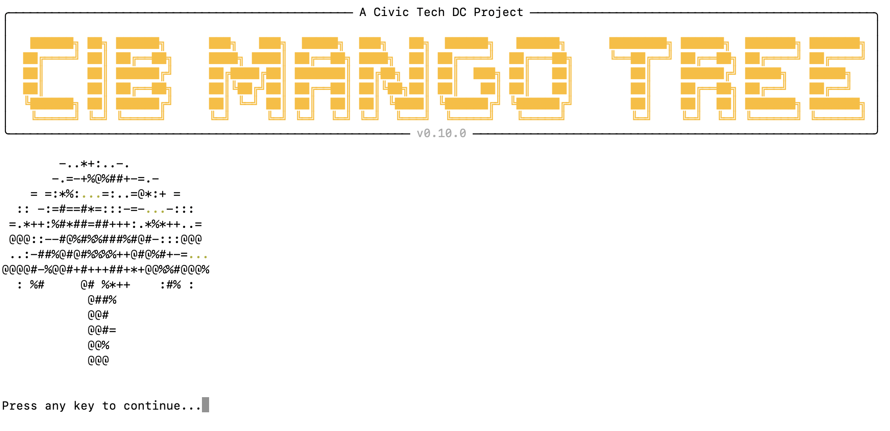

<h1 align="center">CIB Mango Tree</h1>

<h3 align="center">An Interactive Command Line and Dashboard Tool for Detecting Coordinated Inauthentic Behavior Datasets of Online Activity</h3>

---

 

## Download latest release

The latest release is available under Assets in the Releases tab: 
  
[CIB Mango Tree latest](https://github.com/civictechdc/cib-mango-tree/releases/latest)

## Contributing

New contributions are welcome! Before contributing, please check out our [CIB Mango Tree Development Guide](https://civictechdc.github.io/cib-mango-tree). If you are not yet familiar with the project, our [New Contributor Guide](https://civictechdc.github.io/cib-mango-tree/guides/contributing/new_contributor_guide) is the best place to start.

### Installing development version
If you are already familiar with the bigger picture, head over to the [Installation guide](https://civictechdc.github.io/cib-mango-tree/guides/get-started/installation/) in our docs to see how to setup your development environment.

### AI-assisted development.

This repository includes hybrid AI documentation enhanced with semantic code analysis. Please see our short [AI-assisted Development Guide](https://civictechdc.github.io/cib-mango-tree/guides/contributing/ai_assisted_dev).

## License

This project is licensed under the [MIT License](https://opensource.org/license/mit).

### Required Notice

Required Notice: © [CIB Mango Tree](https://github.com/CIB-Mango-Tree)
