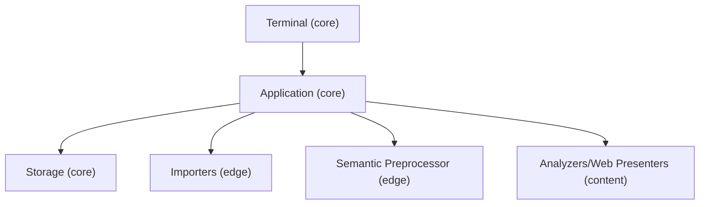
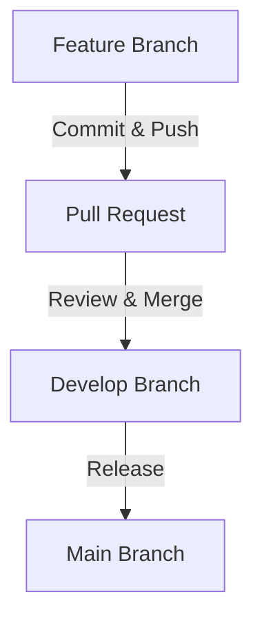

# CIB 🥭 Development Guide

Before contributing please refer to our [**Contributor Workflow**](#contributor-workflow)

## Application Design Overview

The CIB 🥭 application is a terminal-based tool for performing data analysis and visualization. It is designed to be modular and extensible, allowing developers to contribute new analysis modules and visualization components while providing a consistent user experience around data import, preprocessing, and output generation.

This design is motivated by a common pain point when moving from a data analysis script for private use to a tool that can be shared with others: A script for private consumption carries assumptions about the desired input and output data format and structure that are convenient to its author. When such a script is made available to others, debates on these aspects often arise. For a suite of analyses that this project aims to offer, if left decentralized, this debate can lead to inconsistent UX offerings across analyses, code duplication, and even bugs.

The architecture of the CIB 🥭 application is designed to address this problem by providing a clear separation between the core application logic and the analysis modules, such that the analysis module does not need to be concerned with the input and output data format and structure; such responsibilities are handled by the core application, where we aim to provide a rich, consistent, and intuitive user experience.

## Architecture Overview

The application has three "domains":

- The [**Core**](#core-domain) domain is responsible for workspace management, user flow, and integration of analysis runs and data import/export in a generic sense. It has three parts that correspond loosely to the MVC paradigm.
  - The [**Application**](#application) defines the workspace logic and exposes generic capabilities for importing and exporting data as well as analyses and dashboards. This is the "controller" part.
  - The [**Terminal Components**](#terminal-components) render the terminal interface and handle user input. This is the "view" part.
  - The [**Storage IO**](#storage-io) persists the workspace data and is responsible for reading and writing data. This is the "model" part.

  The core application provides the context necessary for the other domains to function in a way that allows them to be agnostic about the specifics of the workspace and user flow.

- The [**Edge**](#edge-domain) domain is responsible for data import and export while being agnostic about the specific analysis being run. Currently, this consists of the **Importers** and the **Semantic Preprocessor**.

  > Note that the Storage IO is currently responsible for data export, but we should consider moving this to the Edge domain to allow for more extensibility and looser coupling.

- The [**Content**](#content-domain) domain is responsible for the actual data analysis and visualization and is agnostic about data import/export or workspace specifics. This consists of the **Analyzers** (both **Primary** and **Secondary**) as well as the **Web Presenters**.



## Core Domain

### Application

The Application [lives here](../app/__init__.py). It is responsible for defining and executing all capabilities of the application's workspace. Any extension or modification of the application's workspace capabilities should be done here.

The application code should be free of specific storage implementation and be agnostic about the specifics of the terminal interface and the available analyzers.

### Terminal Components

The Terminal Components [live here](../components/__init__.py). Their main responsibility is user flow, rendering the terminal interface, and handling user input.

The user flow understandably depends on the set of capabilities offered by the [Application](#application), so an adjustment there may require an adjustment here.

### Storage IO

The Storage IO [lives here](../storage/__init__.py). It is responsible for interacting directly with the file system where the workspace data and data files are stored. It makes decisions on paths, intermediate file formats, and database schema and implementation. It should know as little as possible about how the data is used and should be agnostic about the specifics of the terminal interface and the available analyzers.

## Edge Domain

The Edge domain governs data import and export.

### Importers

The Importers [live here](../importing/__init__.py). Each importer offers a new way to import data into the workspace. The importers should be agnostic about the available analyzers. However, the Importers currently provide a terminal user flow so that their options can be customized by the user—a necessity since each importer may expose different sets of options and may have different UX approaches for their configuration.

The importers eventually write data to a parquet file, whose path is provisioned by the application.

### Semantic Preprocessor

The Semantic Preprocessor [lives here](../preprocessing/series_semantic.py). It defines all the column data semantics—a kind of type system that is used to guide the user in selecting the right columns for the right analysis. It is agnostic about the specific analyzers but does depend on them in a generic way—the available semantics exist to support the needs of analyzers and will be extended as necessary.

## Content Domain

The Content domain is where the analysis and visualization happen.

An analysis is added to the application by defining a **Primary Analyzer**, which comes with an interface declaration and an implementation. The interface declaration defines the input data structure and the output tables, which the application depends on for user guidance. The implementation is made workspace-agnostic by means of the "context" object.

The goal of the Primary Analyzer is to produce a set of output tables that can be used by other analyzers, including **Secondary Analyzers** and **Web Presenters**. Primary Analyzer outputs are ideally normalized, non-duplicated, and non-redundant. As such, they are not always suitable for direct user consumption. It is the job of the Secondary Analyzers to produce user-friendly outputs and the job of Web Presenters to produce interactive visualizations.

Both Secondary Analyzers and Web Presenters are also defined using interface objects. Secondary Analyzers will depend on the output of Primary Analyzers, and Web Presenters will depend on the output of both Primary and Secondary Analyzers.

### Implementing Analyzers

The Primary Analyzer, the Secondary Analyzer, and the Web Presenter are all defined as functions that take a "context" object as their only argument. These context objects are provided by the application. The context object is there to support a contract that is expected between each module and the application.

- The Primary Analyzer context provides the path to the input file and a method to apply the user's preprocessing, which must be called on the input data so that the analyzer receives the columns it expects. It also provides the output path for the analyzer to write its results, which must match the interface declaration. The files are parquet files, and the implementation can use whichever library it prefers to read and write these files.

- The Secondary Analyzer context provides the path to the output file of the Primary Analyzer and the path to the output file that the Secondary Analyzer should write to. The Secondary Analyzer should read the output of the Primary Analyzer and write its output in a way that is suitable for user consumption.

- The Web Presenter context provides the path to the output file of the Primary Analyzer and the paths to the output files of the Secondary Analyzers. It also provides the [Dash](https://pypi.org/project/dash/) application object, which the Web Presenter should use to define its visualizations.

### Contributing a New Analysis

To contribute a new analysis, you should:

- Think about what you need from the user as input and what you want to show the user as output.
- Define a new Primary Analyzer interface and implementation. To start, you might want to output the exportable tables directly. However, as soon as you want to offer a dashboard or more elaborate sets of exportable outputs, you should consider outputting a more normalized set of tables in the Primary Analyzer and then define a Secondary Analyzer to produce the user-friendly outputs.

  > 💚 Using the Primary Analyzer in this way means that other contributors can build on your work. It is a great way to get started if you want to focus on the data science but let others handle data presentation.

- When defining a Secondary Analyzer, be sure to import and provide the Primary Analyzer interface as the "base" interface.
- When defining a Web Presenter, be sure to specify the "base" Primary Analyzer **and** all Secondary Analyzers that your dashboard needs.
- Mark any output not intended for user consumption as "internal" in the interface.
- Add all the defined modules to the [suite](../analyzers/__init__.py).

If you're new to the project, check out
[this directory](../analyzers/example/README.md) for a
workable example.

## Testing

The `testing` module provides testers for the primary and
secondary analyzer modules. See the [example](../analyzers/example/README.md) for further references.

## Logging

The application uses a structured JSON logging system that provides consistent logging across all modules. The logging system automatically separates critical alerts from diagnostic information.

### Logging Architecture

- **Console Output**: Only `ERROR` and `CRITICAL` messages are displayed on stderr
- **File Output**: All messages from `INFO` level and above are written to log files
- **Log Format**: All logs are structured JSON for easy parsing and analysis
- **Log Rotation**: Log files automatically rotate at 10MB with 5 backup files retained
- **Log Location**: `~/.local/share/MangoTango/logs/mangotango.log` (varies by platform)

### Using the Logger in Your Code

#### Basic Usage

```python
from app.logger import get_logger

# Get a logger for your module
logger = get_logger(__name__)

# Log at different levels
logger.debug("Detailed debugging information")
logger.info("General information about program execution")
logger.warning("Something unexpected happened, but the program continues")
logger.error("A serious problem occurred")
logger.critical("A very serious error occurred, program may not be able to continue")
```

#### Example Log Output

**Console (stderr) - Only errors:**
```json
{"asctime": "2025-07-30 16:42:33,914", "name": "analyzers.hashtags", "levelname": "ERROR", "message": "Failed to process hashtags", "taskName": null}
```

**Log File - All info and above:**
```json
{"asctime": "2025-07-30 16:42:33,910", "name": "analyzers.hashtags", "levelname": "INFO", "message": "Starting hashtag analysis", "taskName": null}
{"asctime": "2025-07-30 16:42:33,914", "name": "analyzers.hashtags", "levelname": "ERROR", "message": "Failed to process hashtags", "taskName": null}
```

### Logging in Analyzers

When developing analyzers, add logging to help with debugging and monitoring:

```python
from app.logger import get_logger

def main(context):
    logger = get_logger(__name__)
    
    logger.info("Starting analysis", extra={
        "input_path": str(context.input_path),
        "output_path": str(context.output_path)
    })
    
    try:
        # Your analysis code here
        result = perform_analysis(context)
        
        logger.info("Analysis completed successfully", extra={
            "records_processed": len(result),
            "execution_time": time.time() - start_time
        })
        
    except Exception as e:
        logger.error("Analysis failed", extra={
            "error": str(e),
            "error_type": type(e).__name__
        }, exc_info=True)
        raise
```

### Logging Best Practices

1. **Use Appropriate Log Levels**:
   - `DEBUG`: Detailed diagnostic information, only useful when debugging
   - `INFO`: General information about program execution
   - `WARNING`: Something unexpected happened, but the program continues
   - `ERROR`: A serious problem occurred
   - `CRITICAL`: A very serious error occurred, program may not be able to continue

2. **Include Context with `extra` Parameter**:
   ```python
   logger.info("Processing file", extra={
       "filename": filename,
       "file_size": file_size,
       "record_count": record_count
   })
   ```

3. **Log Exceptions Properly**:
   ```python
   try:
       risky_operation()
   except Exception as e:
       logger.error("Operation failed", exc_info=True)  # Includes stack trace
   ```

4. **Avoid Logging Sensitive Information**:
   - Never log passwords, API keys, or personal data
   - Be cautious with user-provided data

### Debugging with Logs

Users can control log verbosity when running the application:

```bash
# Default INFO level
python -m mangotango

# Verbose DEBUG level for troubleshooting
python -m mangotango --log-level DEBUG

# Only show warnings and errors in log file
python -m mangotango --log-level WARNING
```

### Log File Management

- Log files are automatically rotated when they reach 10MB
- Up to 5 backup files are kept (`mangotango.log.1`, `mangotango.log.2`, etc.)
- Older backup files are automatically deleted
- Log directory is created automatically if it doesn't exist

### Testing with Logs

When writing tests that involve logging:

```python
import logging
from app.logger import get_logger

def test_my_function_logs_correctly(caplog):
    with caplog.at_level(logging.INFO):
        my_function()
        
    assert "Expected log message" in caplog.text
```

## Progress Reporting System

The application uses a sophisticated hierarchical progress reporting system built on the Rich library that provides real-time feedback during long-running analysis operations. This system is designed to eliminate silent processing periods and give users detailed visibility into analysis progress.

### Progress System Components

The progress reporting system consists of three main components:

- **RichProgressManager**: The primary progress manager with hierarchical step and sub-step support
- **ProgressReporter**: Basic multiprocess-compatible progress reporting
- **AdvancedProgressReporter**: tqdm-based progress reporting with ETA calculation

### RichProgressManager

The `RichProgressManager` is the recommended progress reporting solution for analyzers. It provides:

- **Hierarchical progress tracking**: Main steps with detailed sub-steps
- **Rich terminal integration**: Beautiful progress bars and status indicators  
- **Thread-safe operations**: Safe for concurrent progress updates
- **Context manager support**: Clean setup and teardown
- **Memory-aware calculations**: Progress estimates based on dataset characteristics

#### Basic Progress Reporting

```python
from terminal_tools.progress import RichProgressManager

def my_analyzer_function(context):
    # Create progress manager with overall title
    with RichProgressManager("N-gram Analysis Progress") as progress:
        # Add main steps
        progress.add_step("preprocess", "Preprocessing and filtering messages", total=1000)
        progress.add_step("tokenize", "Tokenizing text data", total=500) 
        progress.add_step("generate", "Generating n-grams", total=200)
        
        # Execute first step
        progress.start_step("preprocess")
        for i in range(1000):
            # Do processing work
            process_item(i)
            progress.update_step("preprocess", i + 1)
        progress.complete_step("preprocess")
        
        # Continue with remaining steps...
```

#### Hierarchical Sub-Steps

For complex operations that benefit from granular progress feedback:

```python
def enhanced_analyzer_with_substeps(context):
    with RichProgressManager("Enhanced Analysis") as progress:
        # Add main step
        progress.add_step("write_outputs", "Writing analysis outputs")
        
        # Add sub-steps for detailed progress
        progress.add_substep("write_outputs", "prepare", "Preparing data structures", total=100)
        progress.add_substep("write_outputs", "transform", "Transforming data format", total=200)
        progress.add_substep("write_outputs", "sort", "Sorting results", total=150)
        progress.add_substep("write_outputs", "write", "Writing to file", total=300)
        
        progress.start_step("write_outputs")
        
        # Execute each sub-step
        progress.start_substep("write_outputs", "prepare")
        for i in range(100):
            prepare_data_item(i)
            progress.update_substep("write_outputs", "prepare", i + 1)
        progress.complete_substep("write_outputs", "prepare")
        
        # Continue with other sub-steps...
        progress.complete_step("write_outputs")
```

### Integration with Analysis Context

Analyzers receive progress reporting capability through the analysis context:

```python
def main(context):
    """Primary analyzer with progress reporting."""
    from terminal_tools.progress import RichProgressManager
    
    # The context provides a progress callback for integration
    with RichProgressManager("My Analysis") as progress:
        # Register progress manager with context if needed
        if hasattr(context, 'progress_callback'):
            context.progress_callback = progress
        
        # Your analysis implementation with progress updates
        progress.add_step("analysis", "Running analysis", total=dataset_size)
        progress.start_step("analysis")
        
        for i, item in enumerate(dataset):
            process_item(item)
            progress.update_step("analysis", i + 1)
            
        progress.complete_step("analysis")
```

### Progress Reporting Best Practices

#### 1. Use Descriptive Step Names

```python
# Good - descriptive and specific
progress.add_step("tokenize_text", "Tokenizing social media text", total=messages_count)
progress.add_step("extract_ngrams", "Extracting n-gram patterns", total=token_count)

# Avoid - too generic
progress.add_step("step1", "Processing", total=count)
```

#### 2. Provide Accurate Progress Totals

```python
# Calculate totals based on actual data size
message_count = len(input_dataframe)
progress.add_step("process_messages", "Processing messages", total=message_count)

# For unknown totals, omit the total parameter
progress.add_step("variable_work", "Processing variable amount of data")
```

#### 3. Use Hierarchical Steps for Complex Operations

```python
# For operations that have distinct phases, use sub-steps
progress.add_step("data_output", "Writing analysis results")
progress.add_substep("data_output", "ngram_messages", "Writing n-gram messages", total=ngram_count)
progress.add_substep("data_output", "ngram_definitions", "Writing n-gram definitions", total=definition_count)
progress.add_substep("data_output", "metadata", "Writing metadata", total=metadata_count)
```

#### 4. Handle Errors Gracefully

```python
try:
    progress.start_step("risky_operation")
    perform_risky_operation()
    progress.complete_step("risky_operation")
except Exception as e:
    progress.fail_step("risky_operation", f"Failed: {str(e)}")
    raise
```

### Enhanced N-gram Pattern

The enhanced N-gram analyzer demonstrates the recommended pattern for complex analyzers:

```python
def main(context):
    with RichProgressManager("N-gram Analysis Progress") as progress:
        # Steps 1-8: Traditional progress reporting
        progress.add_step("step_1", "Loading and preprocessing data", total=row_count)
        # ... other steps ...
        
        # Steps 9-11: Hierarchical sub-step progress for final operations
        progress.add_step("step_9", "Writing n-gram messages")
        progress.add_substep("step_9", "prepare", "Preparing message data", total=prepare_total)
        progress.add_substep("step_9", "transform", "Transforming format", total=transform_total)
        progress.add_substep("step_9", "sort", "Sorting by frequency", total=sort_total)
        progress.add_substep("step_9", "write", "Writing to parquet", total=write_total)
        
        # Execute with granular feedback
        _enhanced_write_message_ngrams(context, progress)
```

### Testing Progress Reporting

When writing tests for analyzers with progress reporting:

```python
def test_analyzer_with_progress():
    """Test analyzer progress reporting functionality."""
    from terminal_tools.progress import RichProgressManager
    from unittest.mock import Mock
    
    # Create mock context
    context = Mock()
    context.input_path = test_input_path
    context.output_path = test_output_path
    
    # Test that progress reporting doesn't interfere with analysis
    result = my_analyzer_function(context)
    
    # Verify outputs were created correctly
    assert result is not None
    assert output_path.exists()
```

### Performance Considerations

- **Progress update frequency**: Update progress in reasonable increments (every 100-1000 items) to avoid display overhead
- **Memory usage**: The progress system is designed to be lightweight and memory-efficient
- **Thread safety**: All progress operations are thread-safe with internal locking

### Troubleshooting

#### Common Issues

1. **Progress bars not displaying**: Ensure you're using the context manager (`with` statement)
2. **Progress exceeds total**: Verify your total calculations match actual data size
3. **Sub-steps not showing**: Confirm parent step is active before starting sub-steps

#### Debug Mode

Enable verbose progress logging during development:

```python
import logging
logging.getLogger('terminal_tools.progress').setLevel(logging.DEBUG)
```

## Contributor Workflow

### Overview

All changes should be made in a feature branch, merged into `develop`, and later merged into `main` for a new release.

#### Steps

1. **Create a Feature Branch**
   - Branch from `develop` using `feature/<name>` or `bugfix/<name>`.
   - Example:

     ```bash
     git checkout develop
     git pull origin develop
     git checkout -b feature/new-feature
     ```

2. **Make Changes & Push**
   - Commit changes with clear messages.
   - Push the branch.

     ```bash
     git add .
     git commit -m "Description of changes"
     git push origin feature/new-feature
     ```

3. **Create a Pull Request**
   - Open a PR to merge into `develop`.
   - Address any review feedback.

4. **Merge & Clean Up**
   - After approval, merge into `develop`.
   - Delete the feature branch.

5. **Release**
   - When develop is clean and ready for a new major release, we will merge `develop` into `main`.

### Workflow Diagram



## Questions, Comments, and Feedback

Talk to us on the [Civic Tech DC Slack workspace](https://civictechdc.slack.com)!
